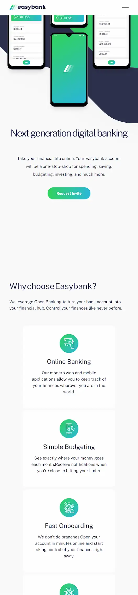
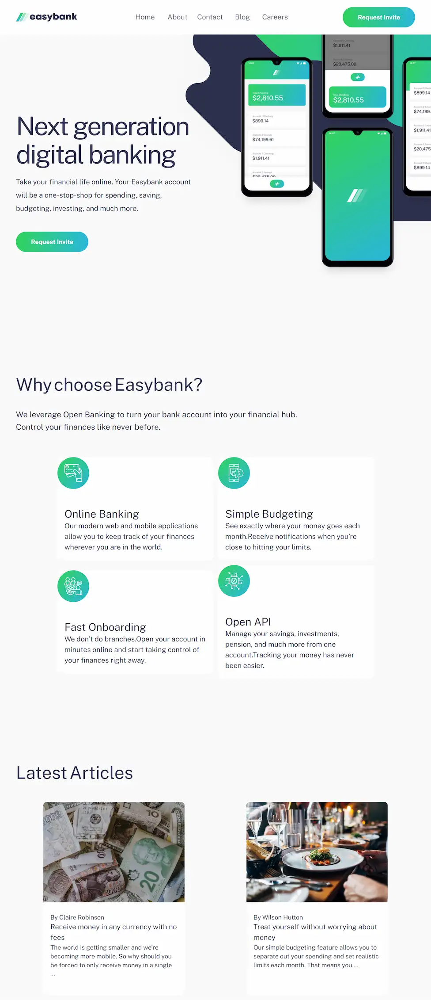
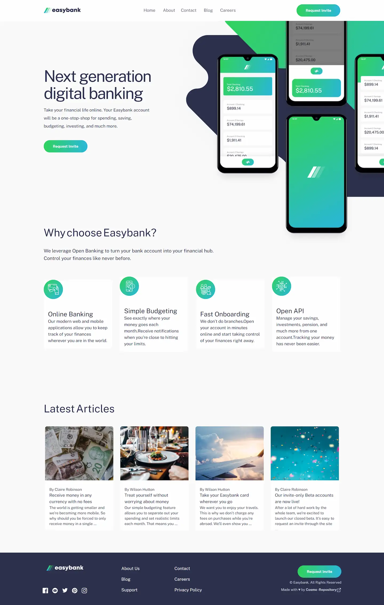

<a href="mailto:cosmohydra17@gmail.com"></img></a>

# Easybank landing page

A small landing page to practice Tailwind, React and responsive. This is a solution to the [Easybank landing page challenge on Frontend Mentor](https://www.frontendmentor.io/challenges/easybank-landing-page-WaUhkoDN).

[Solution][solution-url] . [Live Page][live-page]

Table of contents

-   [Overview](#overview)
    -   [The challenge](#the-challenge)
    -   [Screenshots](#screenshots)
    -   [Links](#links)
-   [My process](#my-process)
    -   [Built with](#built-with)
    -   [What I learned](#what-i-learned)
-   [Author](#author)

## Overview

### The challenge

Users should be able to:

-   View the optimal layout for the site depending on their device's screen size
-   See hover states for all interactive elements on the page

### Screenshots

<table>
        <tr>
		    <td>
                
            </td>
			<td>
                
            </td>
            <td>
                
            </td>
        </tr>
</table>

### Links

-   [Solution][solution-url]
-   [Live Page][live-page]

## My process

### Built with

-   Semantic HTML5 markup
-   Flexbox
-   [React](https://reactjs.org/) - JS library
-   [Vite](https://vitejs.dev/) - Build Tool
-   [Tailwindcss](https://tailwindcss.com/) - CSS framework

(<a href="#top">back to top</a>)

### What I learned

It was an excellent opportunity to reinforce my knowledge in React, tailwind and especially responsive.

(<a href="#top">back to top</a>)

## Author

-   Instagram - [@cosmo_art0](https://www.instagram.com/cosmo_art0/)
-   Frontend Mentor - [@CosmoArt](https://www.frontendmentor.io/profile/cosmoart)
-   Twitter - [@CosmoArt0](https://twitter.com/cosmoart0)
-   My personal page - [https://cosmoart.github.io](https://cosmoart.github.io)

(<a href="#top">back to top</a>)

[live-page]: https://eeasybank.vercel.app
[solution-url]: https://www.frontendmentor.io/solutions/easybank-landing-page-solution-5W8S6TSTtA
